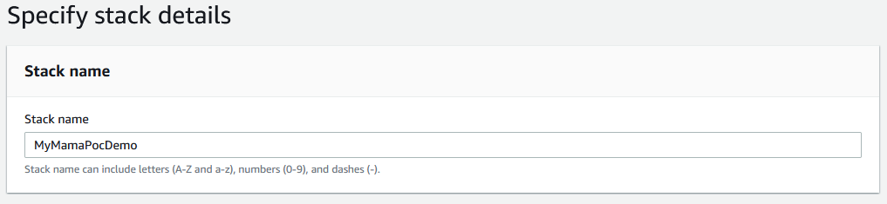

# Managed Audit Manager Assessments (MAMA) - Demo

## Intention

This repository hosts the [AWS CloudFormation](https://aws.amazon.com/cloudformation/) template for my post [Managed Audit Manage Assessments (MAMA) - Redux](https://www.surrealsoftware.com.au/posts/2021-03-04.html).

## First time using Audit Manager

[Audit Manager](https://aws.amazon.com/audit-manager/) needs to be setup before you can use it for the first time:

| Step | Description                                                                                                                                                                                                             |
| ---- | ----------------------------------------------------------------------------------------------------------------------------------------------------------------------------------------------------------------------- |
| 1    |  Navigate to the Audit Manager [console](https://console.aws.amazon.com/auditmanager/home) and click the **Set up AWS Audit Manager** button. |
| 2a   |  Unchecked the `Customize encryption settings (advanced)` to minimise any possibility of configuration errors.                                                   |
| 2b   |  Leave everything else at default settings and click **Complete setup**.                                                                                         |
| 3    |                                                                                                                                                            |

## Deploy the Template

The first step is to save the template locally and then navigate to the [AWS CloudFormation Console](https://console.aws.amazon.com/cloudformation/home).

| Step | Description                                                                                                                                           |
| ---- | ----------------------------------------------------------------------------------------------------------------------------------------------------- |
| 1    | Click [here](https://console.aws.amazon.com/cloudformation/home#/stacks/create/template) to create a new CloudFormation stack.                        |
| 2    |  Select **Upload a template file** and click **Next**.                                                 |
| 3    |  Specify the stack name, e.g. `MyMamaPocDemo` then click **Next**                                           |
| 4    |  Add in the missing parameter values and click **Next**.                                          |
| 5    |  Configure any other stack options as required then click **Next**.                                  |
| 6    |  Perform a final review and acknowledge that named IAM Roles will be created then click **Create stack**. |

Once the stack has deployed, [click here](https://console.aws.amazon.com/auditmanager/home#/assessments) to view the newly created Assessment.

## Finding Frameworks

Once you've setup Audit Manager in your account you can run this AWS CLI command to output a list of all the available Frameworks:

```bash
aws auditmanager list-assessment-frameworks --framework-type Standard
```

If you try and shortcut this before setting up Audit Manager, you will get this error:

```text
An error occurred (AccessDeniedException) when calling the ListAssessmentFrameworks operation: Please complete AWS Audit Manager setup from home page to enable this action in this account.
```
